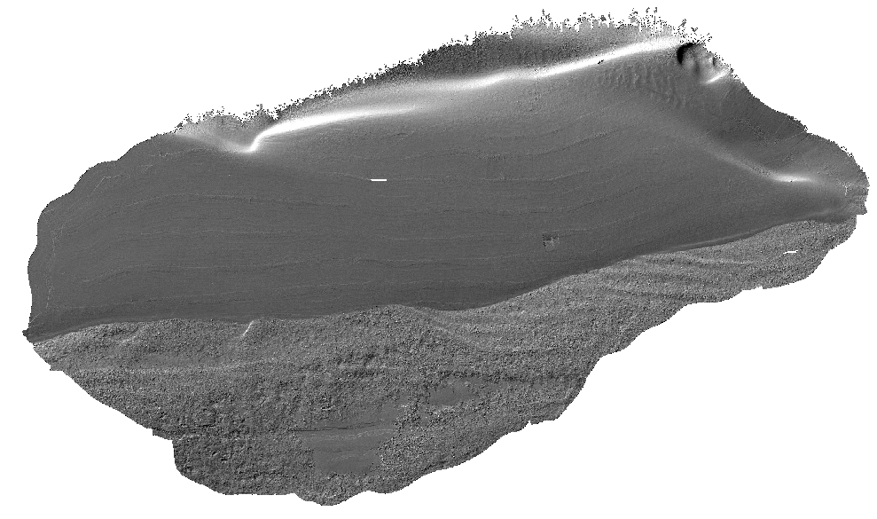

# USGS Northern Lake Michigan Reefs: DEM Processing Tools

This repository contains Python scripts and tools for processing, analyzing, and visualizing bathymetric data related to the USGS Northern Lake Michigan Reefs project. The toolkit automates the generation of spatial derivative products from Digital Elevation Models (DEMs) and Backscatter intensity data to support habitat classification.

## Table of Contents

- [Project Overview](#project-overview)
- [Requirements](#requirements)
- [Installation](#installation)
- [Usage: Generating Products](#usage-generating-products)
- [Methodology & Workflow](#methodology--workflow)
- [Repository Structure](#repository-structure)
- [Disclaimer](#disclaimer)
- [Contact](#contact)

## Project Overview

The goal of this project is to standardize the processing of high-resolution bathymetry to support the study and management of reef habitats. The core tool (`generateProducts.py`) ingests a DEM and produces a suite of standardized geomorphometric and texture analysis layers.

## Requirements

*   **ArcGIS Pro 3.2+ (Advanced License):** Required for `arcpy` and the Spatial Analyst extension.
*   **Python 3.9+:** Configured within the ArcGIS Pro environment.
*   **Hardware:** 
    *   Minimum: 32GB RAM
    *   Recommended: 64GB+ RAM for large un-tiled datasets.

### Dependencies
The project relies on the standard `arcpy` environment plus specific scientific libraries:
*   `arcpy` (Spatial Analyst)
*   `rasterio`
*   `numpy`
*   `scipy`
*   `scikit-image`
*   `matplotlib`
*   `gdal` (via OSGeo)

## Installation

Because this tool relies on **ArcPy**, it is best run within a cloned ArcGIS Pro Conda environment.

1.  **Clone the Repository:**
    ```bash
    git clone https://code.usgs.gov/great-lakes-science-center/computer-vision/usgs_northern_lm_reefs_processing.git
    cd USGS_Northern_LM_Reefs_processing
    ```

2.  **Configure Environment:**
    Open the **Python Command Prompt** from the ArcGIS Pro program group.
    
    *Option A: Use existing environment (if packages are installed)*
    ```bash
    pip install rasterio scikit-image matplotlib
    ```

    *Option B: Create a fresh clone (Recommended)*
    ```bash
    conda create --name usgs_reefs --clone arcgispro-py3
    activate usgs_reefs
    conda install -c conda-forge rasterio scikit-image gdal
    ```

## Usage: Generating Products

The primary interface is the `scripts/generateProducts.py` script. It handles data pre-processing, tiling for large datasets, and parallel product generation.

### Basic Syntax

```bash
python scripts/generateProducts.py --input_dem "path/to/dem.tif" [OPTIONS]
```

### Command Line Arguments

| Argument | Type | Default | Description |
| :--- | :--- | :--- | :--- |
| `--input_dem` | Path | **Required** | Path to the input bathymetric DEM (GeoTIFF). |
| `--input_bs` | Path | `None` | Path to associated Backscatter mosaic. Used for alignment and trimming. |
| `--input_binary_mask` | Path | `None` | Path to a binary mask (0/1) defining the exact processing boundary. |
| `--divisions` | Int | `None` | **Highly Recommended for large files.** Splits the DEM into $N \times N$ tiles (e.g., 20) to manage memory. Includes automatic overlap handling. |
| `--products` | List | *All* | Space-separated list of products to generate (see list below). |
| `--shannon_window` | List | `3 9 21` | Window sizes (in pixels) for Shannon Entropy texture analysis. |
| `--fill_method` | Str | `IDW` | Method to fill small internal voids before processing: `IDW`, `FocalStatistics`, or `NoFill`. |
| `--remove_chunks` | Flag | `False` | If set, deletes temporary tile chunks after the final mosaic is created. |

### Available Products
You can specify any combination of the following for the `--products` argument:
*   **Standard:** `slope`, `aspect`, `roughness`, `tpi`, `tri`, `hillshade`
*   **Texture:** `shannon_index` (multi-scale), `lbp-9-1`, `lbp-15-2`, `lbp-21-4` (Local Binary Patterns 3-choice n-points radius combinations)
*   **Landforms:** `bathymorphons` (Generates Raw, 10-class, 6-class, 5-class, and 4-class geomorphon maps)

### Examples

**1. Standard Run (Small Rasters)**
Generates standard terrain variables and texture metrics.
```bash
python scripts/generateProducts.py --input_dem "data/BayHarbor_1m.tif"
```

**2. Processing Large Datasets (Tiling)**
For large surveys (e.g., >2GB files), use `--divisions` to split the task into tiles (e.g., 20 divisions creates ~400 tiles). This prevents memory errors and uses parallel processing.
```bash
python scripts/generateProducts.py \
  --input_dem "data/LakeMichigan_2m.tif" \
  --divisions 20 \
  --remove_chunks
```

**3. Generating Landforms (Geomorphons)**
To generate Bathymorphons (Geomorphons), add the `bathymorphons` keyword. This utilizes ArcPy's pattern recognition to classify terrain features (Ridges, Valleys, Flats, etc.).
```bash
python scripts/generateProducts.py \
  --input_dem "data/BayHarbor_1m.tif" \
  --products slope bathymorphons
```

## 4. Multiscale Processing - Jupyter Notebook
### 📂 Expected File Tree Structure

```text
C:\path\to\base\directory\           <-- BASE_DIR
└── MissionPoint\                    <-- REEF_NAME
    ├── 1m\                          <-- TARGET_RESOLUTIONS[0]
    │   ├── MP_1m_BY.tif             <-- (ABRV + Res + DEM_MARKER)
    │   └── MP_1m_BS.tif             <-- (ABRV + Res + BS_MARKER)
    │
    ├── 0.5m\                        <-- TARGET_RESOLUTIONS[1]
    │   ├── MP_0.5m_BY.tif
    │   └── MP_0.5m_BS.tif
    │
    └── 0.25m\                       <-- TARGET_RESOLUTIONS[2]
        ├── MP_0.25m_BY.tif
        └── MP_0.25m_BS.tif
```
## Methodology & Workflow

To ensure statistical validity and seamless output, the tool applies the following processing chain:

<p align="left">
  
  
  
</p>
<p align="left">
  <em><strong>Figure 1.</strong> Derived Products of Bay Harbor, Lake Michigan multibeam survey. Hillshade shown on left, the Shannon entropy texture analysis middle, and the 10-class landforms (geomorphons) right.</em>
</p>

### 1. Pre-Processing and Alignment
*   **Grid Standardization:** Input rasters are aligned to the 1-meter DEM ("Master Snap Raster").
*   **Gap Filling (Inpainting):** Small internal gaps and NoData artifacts are inpainted using iterative Inverse Distance Weighted (IDW) interpolation to ensure continuous surfaces for neighborhood calculations.
*   **Sanitization:** Large negative floating-point values (often representing NoData in GDAL) are cleaned to prevent arithmetic overflows in derivative calculations.

### 2. Derivative Calculation & Tiled Processing
To handle high-resolution datasets efficiently, rasters are segmented into manageable processing tiles.

*   **Edge Effect Mitigation:** A dynamic overlap buffer calculated as `⌊W_max / 2⌋ + 1` is applied to every tile. This allows neighborhood operations (e.g., Shannon Entropy) to "see" into the adjacent tile, effectively eliminating seaming artifacts.
*   **Product Generation:**
    *   **Morphometrics:** Slope, Aspect, Roughness, TPI, TRI, Hillshade.
    *   **Texture:** Shannon Entropy (multi-scale) and Local Binary Patterns (LBP).
    *   **Bathymorphons:** 10-class, 6-class, 5-class, 4-class classification based on ternary pattern recognition.

### 3. Post-Processing
*   **Seamless Mosaicking:** Tiles are merged back into a single continuous raster using specific pixel-type mappings and compression (LZW).
*   **Artifact Removal:** A final trimming pass is applied using the original binary mask to remove "halo" artifacts generated by windowing functions at the dataset edges.

## Repository Structure

```
USGS_Northern_LM_Reefs_processing/
│
├── src/                 # Core Python modules
│   ├── processDem.py    # Main orchestration logic (Tiling, Overlap, Merging)
│   ├── derivatives.py   # Algorithms for Slope, TRI, Shannon, etc.
│   ├── landforms.py     # Geomorphon calculation and classification
│   └── arcpyUtils.py    # Helper functions for ArcPy interaction
│
├── scripts/             # Execution scripts
│   └── generateProducts.py # CLI Entry point
│
├── notebooks/           # Jupyter notebooks for analysis and visualization
├── requirements.txt     # Python dependencies
└── README.md            # This file
```

## Disclaimer

This software has been approved for release by the U.S. Geological Survey (USGS). Although the software has been subjected to rigorous review, the USGS reserves the right to update the software as needed pursuant to further analysis and review. No warranty, expressed or implied, is made by the USGS or the U.S. Government as to the functionality of the software and related material nor shall the fact of release constitute any such warranty. Furthermore, the software is released on condition that neither the USGS nor the U.S. Government shall be held liable for any damages resulting from its authorized or unauthorized use.

## Contact

*   **Anthony Geglio** (ageglio@mtu.edu)
*   **Peter Esselman** - USGS Great Lakes Science Center
*   **Advanced Technology Lab** - Ann Arbor, MI